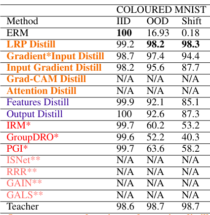

# Explanation Distillation

Bias and spurious correlations in data can cause shortcut learning, undermining out-of-distribution (OOD) generalization in deep neural networks. Most methods require unbiased data during training (and/or hyper-parameter tuning) to counteract shortcut learning. Here, we propose the use of explanation distillation to hinder shortcut learning. The technique does not assume any access to unbiased data, and it allows an arbitrarily sized student network to learn the reasons behind the decisions of an unbiased teacher, such as a vision-language model or a network  processing debiased images. We found that it is possible to train a neural network with explanation (e.g by Layer Relevance Propagation, LRP) distillation only, and that the technique leads to high resistance to shortcut learning, surpassing group-invariant learning, explanation background minimization, and alternative distillation techniques. In the COLOURED MNIST dataset, LRP distillation achieved 98.2% OOD accuracy, while deep feature distillation and IRM achieved 92.1% and 60.2%, respectively. In COCO-on-Places, the undesirable generalization gap between in-distribution and OOD accuracy is only of 4.4% for LRP distillation, while the other two techniques present gaps of 15.1% and 52.1%, respectively.


# Reproduce COLOURED MNIST Results

#### Download colored mnist dataset, mnistColor, extract it and place it in ExplanationDistillation/data/

https://drive.google.com/drive/folders/1egfaoWJMv9Wdinmuu4luEnA-QGZegCqL?usp=sharing

#### Download teacher network, Teacher.pt, and plce it in ExplanationDistillation/Trained/

https://drive.google.com/drive/folders/1egfaoWJMv9Wdinmuu4luEnA-QGZegCqL?usp=sharing

#### Prepare environment (Conda)
```
cd ExplanationDistillation
conda env create -f environment.yml
conda activate explanation_distillation
python -m ipykernel install --user --name explanation_distillation --display-name "explanation_distillation"
```

#### Train neural networks by distilling explanations only: run Jupyter notebook to reproduce the MNIST results in the manuscript Table 1
```
cd mnist
jupyter notebook DistillMNIST.ipynb
```
 
The results should be similar to the ones below (manuscript Table 1), although some variance is expected, due to random initialization. Notice that the code does not reproduce models that were not trained by us (in red).

<p align="center">
  
</p>


# Main code

DistillationCode/OfflineStudentZVariableEpsTorch.py: main library for explanation distillation, based on PyTorch, use to train the student network

DistillationCode/OfflineStudentLightningTrainer.py: Pytorch Lightning implementation of explanation distillation. Used in all our distillation experiments, when training the student