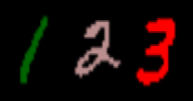

<div align="center">
  
  <br>
  <h1><strong>Explanation Distillation</strong></h1>
</div>

Bias and spurious correlations in data can cause shortcut learning, undermining out-of-distribution (OOD) generalization in deep neural networks. Most methods require unbiased data during training (and/or hyper-parameter tuning) to counteract shortcut learning. **We propose the use of explanation distillation to hinder shortcut learning, improving bias robustness and out-of-distribution generalization.** Benefits:
- Explanation distillation **needs no unbiased data for training or validation**. You do not need to known which samples have spurious correlations. In fact, **100% of your dataset can be biased!** You just need an unbiased teacher, like a large vison-language model or a network running on debiased (e.g., segmented) data
- Explanation distillation reduces bias by making an arbitrarily sized student network **learn the reasons behind the decisions** of a large teacher, instead of just mimicking the teacher's outputs - removing the standard classification and distillation losses improved bias robustness
- We found that it is **possible to train a neural network with explanation distillation only** (e.g., optimizing Layer-wise Relevance Propagation/LRP heatmaps)
- Explanation distillation **leads to high resistance to dataset bias and shortcut learning**

## Findings

In our experiments, explanation distillation surpassed group-invariant learning, explanation background minimization, and alternative distillation techniques
- In the COLOURED MNIST dataset, LRP distillation achieved 98.2% OOD accuracy, while deep feature distillation and IRM achieved 92.1% and 60.2%, respectively
- In COCO-on-Places, the undesirable generalization gap between in-distribution and OOD accuracy is only of 4.4% for LRP distillation, while deep feature distillation and IRM present gaps of 15.1% and 52.1%, respectively


# Reproduce COLOURED MNIST Results

<div align="center">
  
  <br>
</div>

#### Download colored mnist dataset, mnistColor, extract it and place it in ExplanationDistillation/data/

https://drive.google.com/drive/folders/1Ghg17vjSnaq5H4jihM3ehmYrAX8NGsYP?usp=sharing

#### Download teacher network, Teacher.pt, and plce it in ExplanationDistillation/Trained/

https://drive.google.com/drive/folders/1Ghg17vjSnaq5H4jihM3ehmYrAX8NGsYP?usp=sharing

#### Prepare environment (Conda)
```
cd ExplanationDistillation
conda env create -f environment.yml
conda activate explanation_distillation
python -m ipykernel install --user --name explanation_distillation --display-name "explanation_distillation"
```

#### Train neural networks by distilling explanations only: run Jupyter notebook to reproduce the MNIST results in the manuscript Table 1
```
cd mnist
jupyter notebook DistillMNIST.ipynb
```
 
The results should be similar to the ones below (manuscript Table 1), although some variance is expected, due to random initialization. Notice that the code does not reproduce models that were not trained by us (in red). In the table, the most similar the results across the 3 columns, the less biased the model.

<p align="center">
  
</p>


# Main code

DistillationCode/OfflineStudentZVariableEpsTorch.py: main library for explanation distillation, based on PyTorch, use to train the student network

DistillationCode/OfflineStudentLightningTrainer.py: Pytorch Lightning implementation of explanation distillation. Used in all our distillation experiments, when training the student

# Citation

Comming soon.
